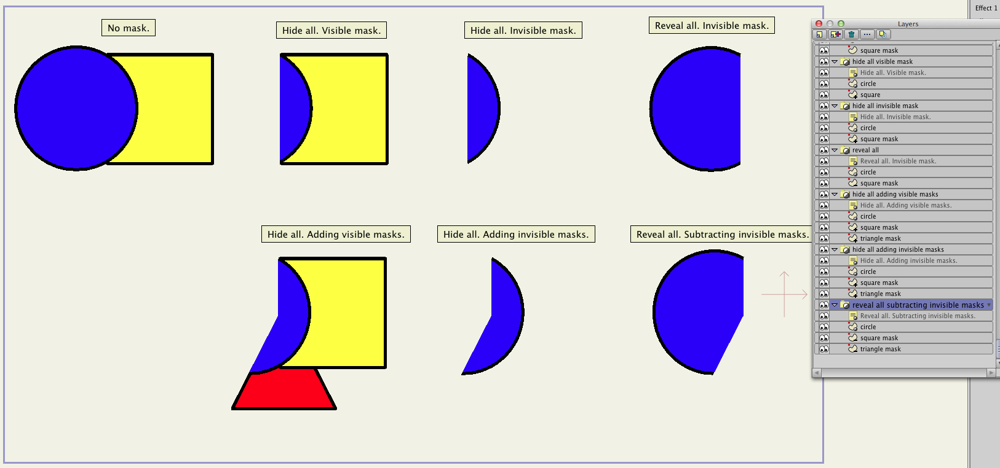
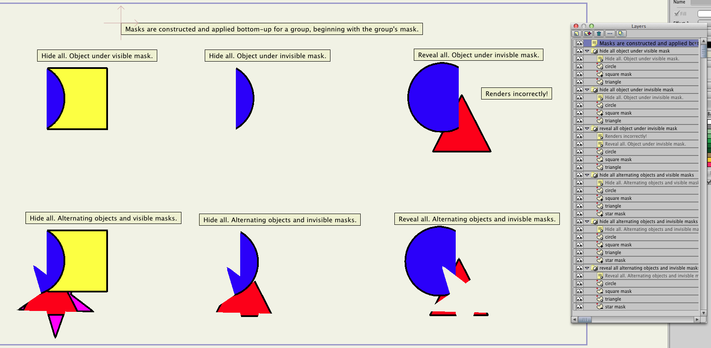
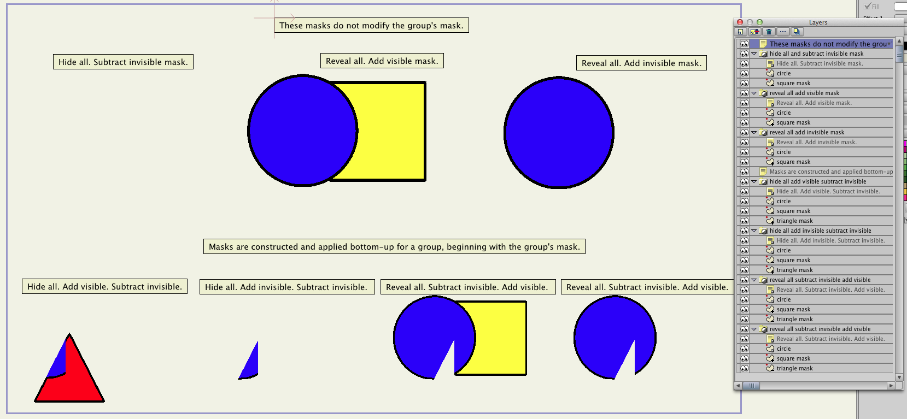
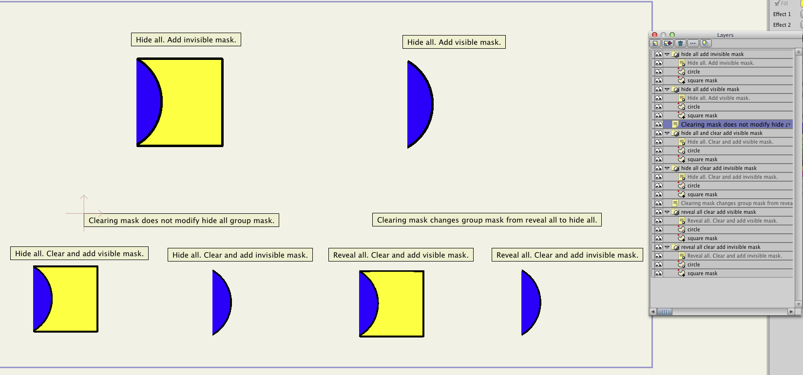

masking-tests
=============

I created this series of four project files to better understand Anime Studio masking behavior, particularly when additive and subtractive mask layers are interleaved with masked layers. 

The epiphany for me was the realization that **masks are constructed and applied bottom-up,** starting with the mask of the containing group layer, and then proceeding from the lowest layer in the group to the top layer. Once I understood this, I understood how complex masking works, like the masking used for [selgin's elegant head turn approach.](http://www.lostmarble.com/forum/viewtopic.php?t=15846)

In order to understand how any of these examples work, it's necessary to understand how the previous examples work so I recommend starting from the beginning. The screen shots below provide an overview of each set of examples, but you'll probably want to [download the project files](https://github.com/gwbond/anime-studio/archive/master.zip) to inspect individual layer mask settings. Also, to gain further insight, I recommend enabling/disabling the visibility of individual mask layers which, in turn, enables/disables the layer's mask.

These screenshots are from Anime Studio Pro version 9.5.

masking-test-01
---------------

masking-test-02
---------------

masking-test-03
---------------

masking-test-04
---------------

