selgin-head-turn
================

[Victor Paredes](http://animadoresporunacausa.blogspot.com) (aka "selgin") is a talented artist, animator and Anime Studio user who conceived [a clever approach](http://www.lostmarble.com/forum/viewtopic.php?t=15846) for smoothly animating a turning head. He describes a realistic example [here](https://vimeo.com/28938430) (pass: selgin). Selgin's approach utilizes advanced masking techniques and fazek's [meshinstance layer script.](http://www.lostmarble.com/forum/viewtopic.php?t=15845). 

This project illustrates a variation on selgin's head turn approach that uses switch layers for the mouth and jaw in order to take advantage of Anime Studio's built-in switch layer-based lip syncing. The project has been tested with Anime Studio Pro 9.5.

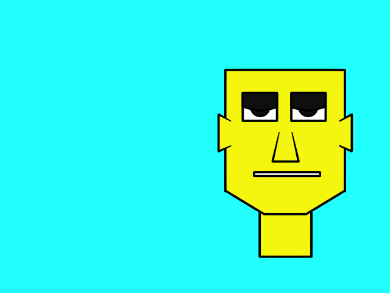

Overview
--------

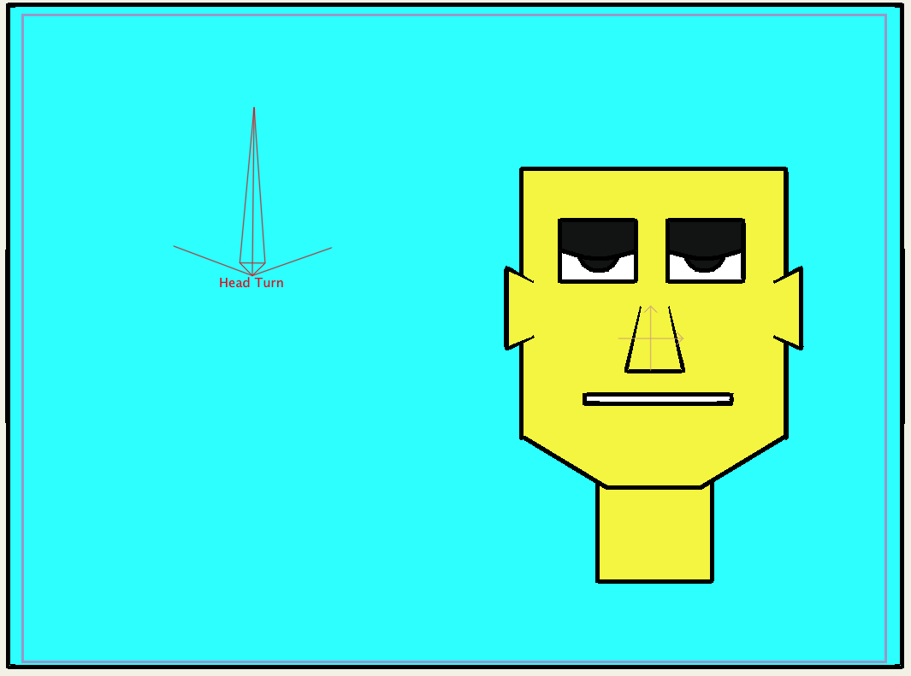

The project relies on two layer scripts included [in this repo](../../scripts/layer): GWB_MoveTogether and GWB_SwitchTogether. The former, a completely overhauled version of fazek's and ramon0's meshinstance layer script, is used to replicate point motion and curvature across vector layers. The latter replicates keyframes across switch layers. The approach also relies on animated layer ordering and relatively complex layer masking that derives from selgin's masking approach. Head turn animation is defined as a smart bone action. Compared to the rigging, the actual animation for this project was simple, basically following the same approach selgin demonstrates [here](https://vimeo.com/28938430) (pass: selgin). Selgin also provides a nice demonstration of layer order animation, used for this project's ears, [here](http://www.youtube.com/watch?v=zk--aWuAZnM)

### Layer Scripts ###

A layer naming convention is adopted to convey individual layer functions and their relationships to one another. A layer name in square brackets signifies the layer acts as an invisible mask e.g., "[face]". A layer name of the form "name1 > name2" indicates that the layer, representing "name1", is linked by a layer script to the layer named "name2". For those familiar with the meshinstance layer script, "name2" is acting as a "source" layer and "name1" is acting as a "dup" (duplicate) layer.  For example, the (dup) layer named "face > [face]" indicates that the layer, representing the "face" is linked to the (source) "[face]" layer.

If a switch layer is linked to another layer, then the dup layer's switch keyframes are duplicates of the source layer's e.g., "jaw > [jaw]" keyframes are duplicates of the "[jaw]" layer's keyframes. The [GWB_SwitchTogether](../../scripts/layer/GWB_SwitchTogether.lua) layer script is used to accomplish this behavior. If a vector layer is linked to another layer, then the dup layer's point motion and curvature are duplicates of the source layer's e.g., "[lips].closed > lips.closed" point motion/curvature are duplicates of the "lips.closed" layer's point motion/curvature. The [GWB_MoveTogether](../../scripts/layer/GWB_MoveTogether.lua) layer script is used to accomplish this behavior. 

Because a source layer acts as a "master" layer, and a dup layer acts as a "slave", only "source" layers need to be animated, and "dup" layers are automatically animated via the layer scripts. In this project, only the "[jaw]" switch layer is used to animate switching behavior of the other three linked switch layers e.g., when the active sub-layer of the "[jaw]" switch layer is "[jaw].open", then all the linked layers switch to their respective ".open" sub-layers. And only the point motion/curvature of the vector layers "[jaw].open", "[jaw].close", "lips.open", "lips.close" and "[face]" need to be modified because the point motion/curvature of other five linked vector layers are updated automatically e.g., changing the point motion/curvature of the "lips.open" layer automatically updates the point motion curvature of the linked "[lips].open > lips.open" layer.

### Masks ###

Here's an overview of the project's masks. If you're not completely comfortable with Anime Studio masking - and you defintely need to be comfortable with masking to understand how masking is used here - then I recommend taking a look at the [series of masking examples](../masking-tests) I put together to help me understand masking. For the impatient, the take-away from these exercises is:  **masks are constructed and applied bottom-up,** starting with the mask of the containing group layer, and then proceeding from the lowest layer in the group to the top layer.

So let's start with the bottom-most mask and work our ways upwards. The bottom-most mask is defined by the containing "head" group, and is set to "hide all."

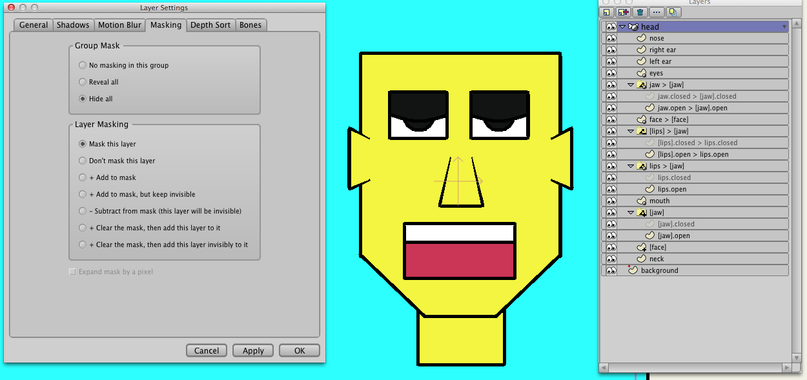

Moving up the group, the "neck" layer is not masked, but simply occluded by visible layers above it. The next mask is the "[face]" mask which is invisibly added to the "head" mask. The "[face]" mask serves to clip the visible "mouth", "lips > [jaw]", and "eyes" layers when they extend outside the mask boundary. 

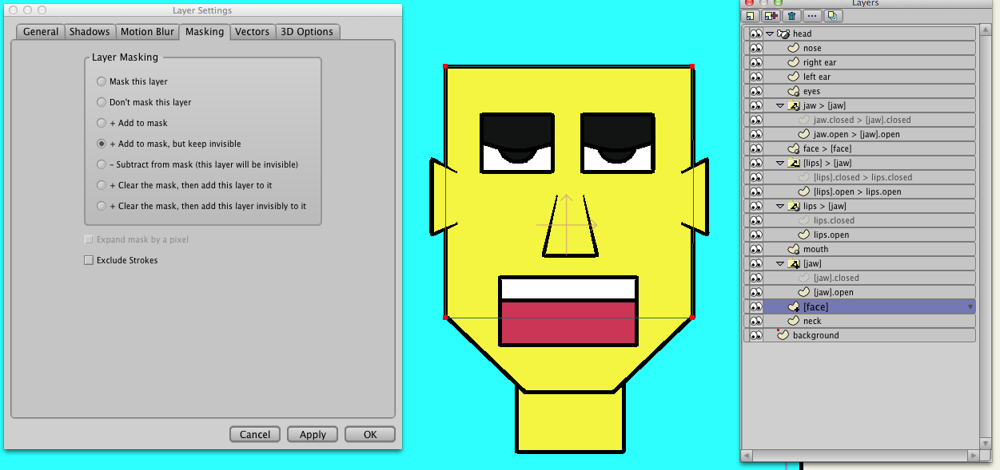

Next up is the "[jaw]" mask which is a switch layer because the jaw moves as the lips move. The currently active "[jaw]" sub-layer is added invisibly to the "[face]" mask and serves the same purpose as the "[face]" mask: to clip the visible "mouth", "lips > [jaw]", and "eyes" layers when they extend outside the mask boundary. 

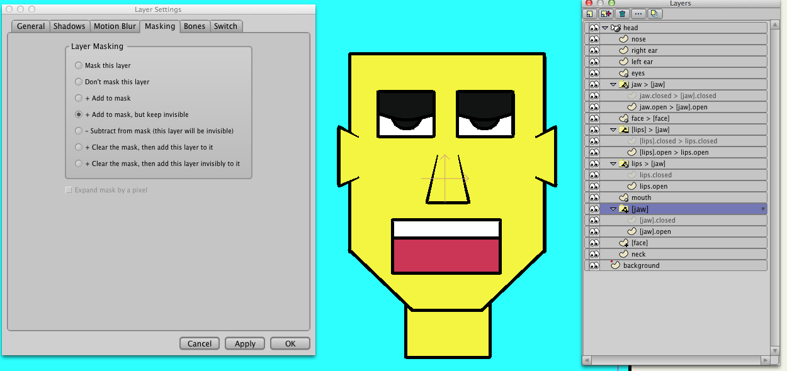

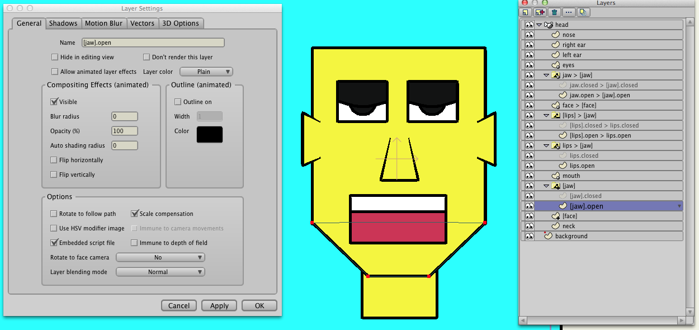

The "mouth" layer contains visible objects depicting teeth and the inside of the mouth. This layer is masked so that it is clipped when positioned outside the underlying "[face]" and "[jaw]" layer masks.

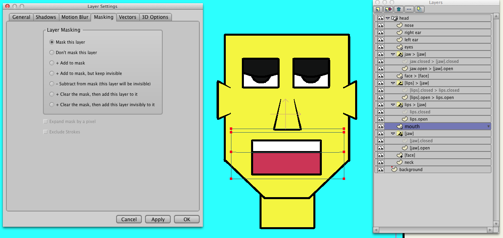

Above the "mouth" is the "lips > [jaw]" switch layer, representing the currently active lip position. This visible layer is masked so that it is clipped by the underlying masks when the lips extend outside the mask boundary. The lips object itself consists of a stroked rectangle with transparent fill so that the underlying mouth objects appear through the lips.

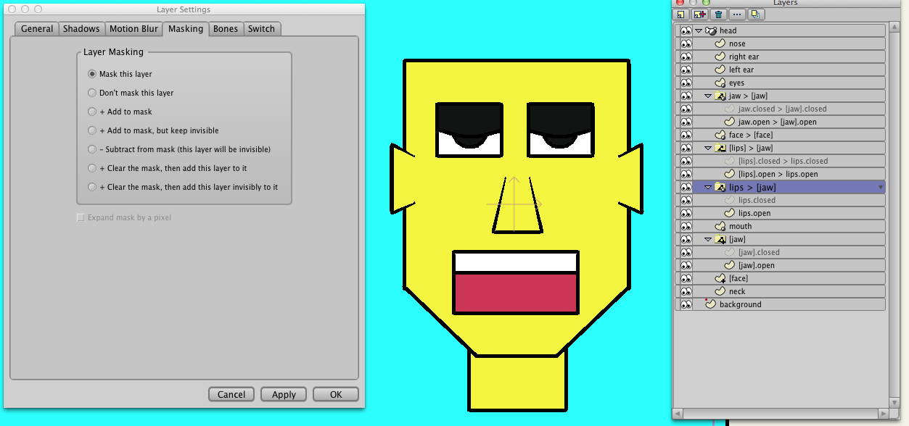

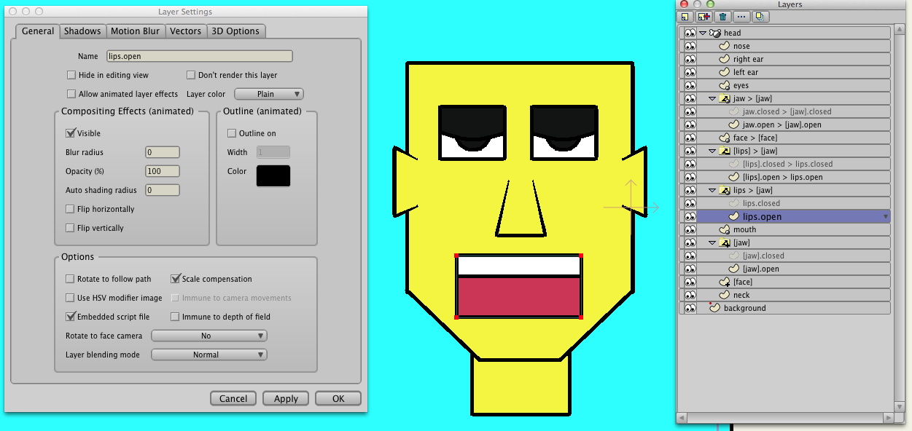

Next is the "[lips] > [jaw]" switch mask layer. In contrast to previous mask layers, this layer invisbly subtracts from the underlying mask, leaving a lips-shaped hole the mask. The resulting mask, applied to visible layers above it, namely the "face > [face]" and "jaw > [jaw]" layers, allows the underlying "lips > [jaw]" and "mouth" layers to be visible through the hole.

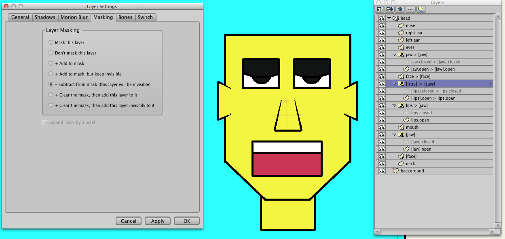

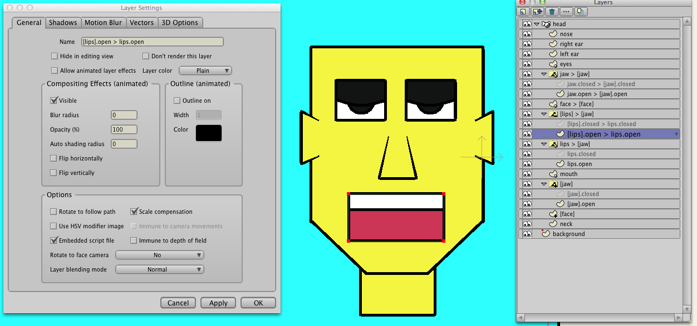

The  "face > [face]" layer is the masked visible face and the "jaw > [jaw]" switch layer is the masked visible jaw. As described above, the underlying mask applied to these layers cuts a lip-shaped hole in the face through which the underlying "lips > [jaw]" and "mouth" layers appear.

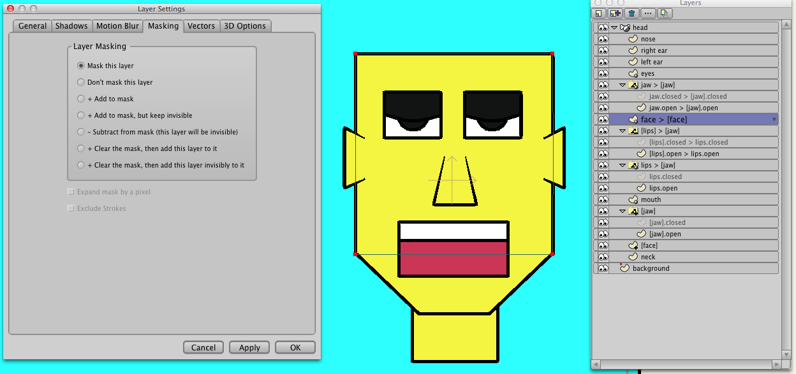

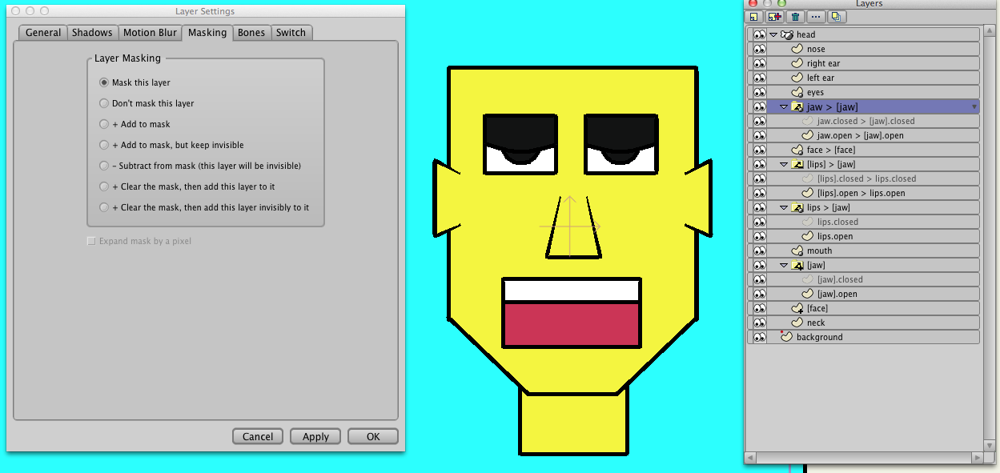

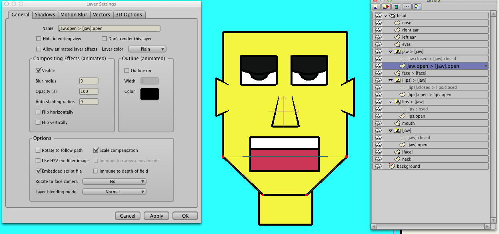

Finally, there are the masked visible "eyes", unmasked visible "left ear" and "right ear", and unmasked visible "nose" layers. Being masked, the "eyes" layer is clipped by the underlying masks when the eyes extend outside the underlying mask boundary.

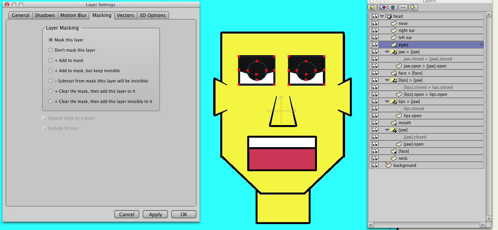

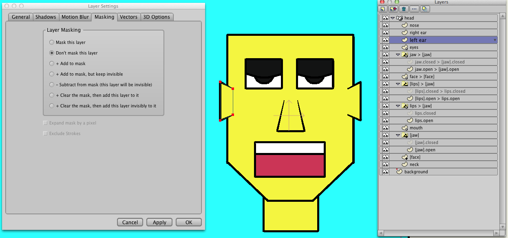

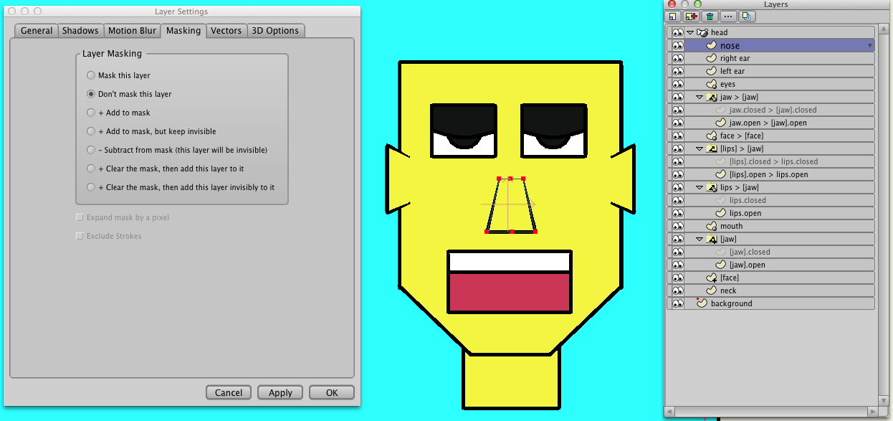
