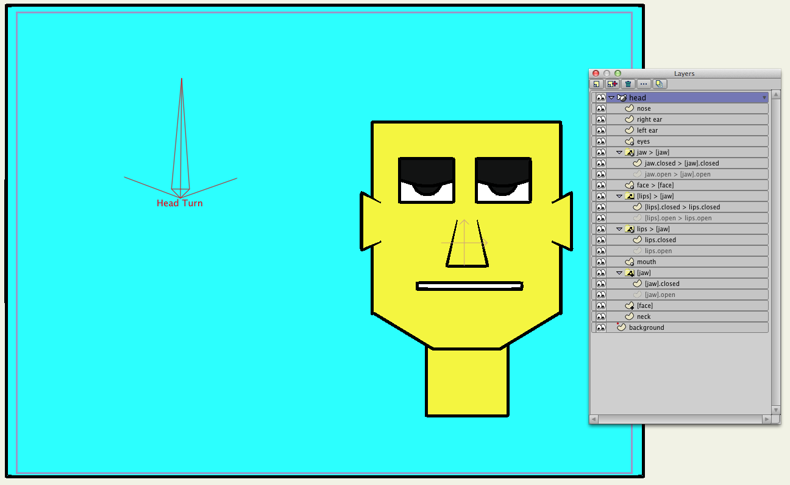

selgin-head-turn
================

Gilbert Concepcion (aka "selgin") is a talented artist, animator and Anime Studio user who conceived [a clever approach](http://www.lostmarble.com/forum/viewtopic.php?t=15846) for smoothly animating a turning head. He describes a realistic example [here](https://vimeo.com/28938430) (pass: selgin).

Selgin's approach utilizes advanced masking techniques and fazek's [meshinstance layer script.](http://www.lostmarble.com/forum/viewtopic.php?t=15845). Selgin's approach was almost exactly what I was looking for. What the approach didn't handle was using switch layers to support Anime Studio's built-in lip syncing. 

This project illustrates a variation on selgin's head turn approach that includes using switch layers for the mouth and jaw. The project has been tested with Anime Studio Pro 9.5.

Overview
--------

The project relies on two layer scripts included [in this repo](../../scripts/layer): GWB_MoveTogether and GWB_SwitchTogether. The former, a re-factored version of fazek's and ramon0's meshinstance layer script, is used to replicate point motion and curvature across vector layers. The latter replicates keyframes across switch layers. The approach also relies on animated layer ordering and relatively complex layer masking. 

A layer naming convention is adopted to convey individual layer functions and their relationships to one another. A layer name in square brackets signifies the layer acts as an invisible mask e.g., "[face]". A layer name of the form "name1 > name2" indicates that the layer, representing "name1", is linked by a layer script to the layer named "name2". For those familiar with the meshinstance layer script, "name2" is acting as a "source" layer and "name1" is acting as a "dup" (duplicate) layer.  For example, the (dup) layer named "face > [face]" indicates that the layer, representing the "face" is linked to the (source) "[face]" layer.

If a switch layer is linked to another layer, then the linked layer's switch keyframes are duplicates of the source layer's e.g., "jaw > [jaw]" keyframes are duplicates of the "[jaw]" layer's keyframes. The [GWB_SwitchTogether](../../scripts/layer/GWB_SwitchTogether.lua) layer script is used to accomplish this behavior. If a vector layer is linked to another layer, then the linked layer's point motion and curvature are duplicates of the source layer's e.g., "[lips].closed > lips.closed" point motion/curvature are duplicates of the "lips.closed" layer's point motion/curvature. The [GWB_MoveTogether](../../scripts/layer/GWB_MoveTogether.lua) layer script is used to accomplish this behavior. 

Because a "source" layer acts as a "master" layer, and a "dup" layer acts as a "slave", modifications need only be made to "source" layers, and "dup" layers are automatically updated via the layer scripts. In this project then, only the "[jaw]" switch layer is used to control switching behavior of the other three linked switch layers. And only the point motion/curvature of the vector layers "[jaw].open", "[jaw].close", "lips.open", "lips.close" and "[face]" need to be modified because the point motion/curvature of other five linked vector layers are updated automatically.

Because of this master/slave relationship between layers, all linked layers can be ignored when animating: the "jaw > [jaw]" switch layer and its sub-layers, the "face > [face]" vector layer, the "[lips] > [jaw]" switch layer and its sub-layers, and the "lips > [jaw]" switch layer (but not its sub-layers).

There's a more detailed explanation of the masking behavior here.

